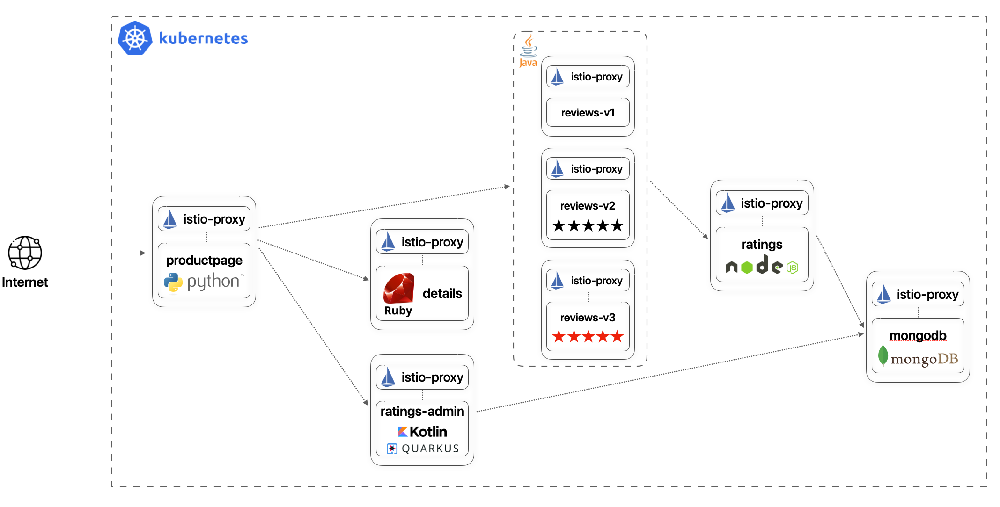
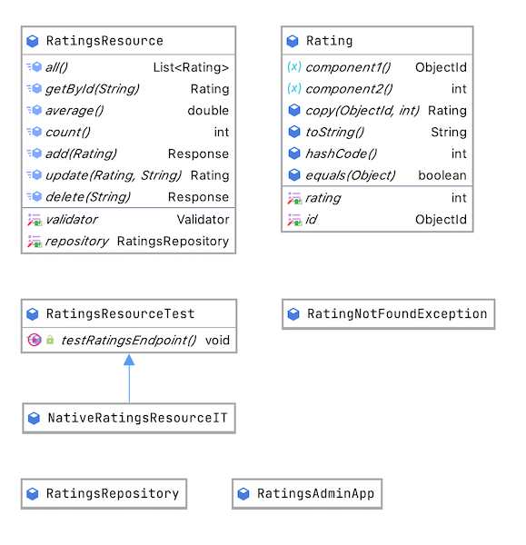
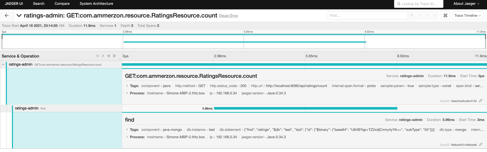
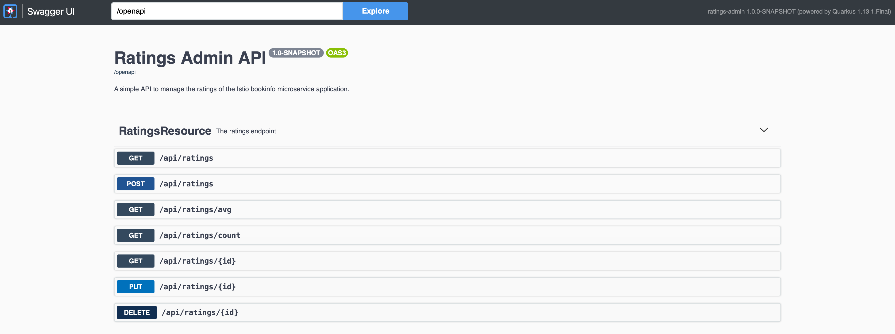

# Ratings Admin Microservice

First exercise for the subject 20_SVE2UE at FH OÖ Campus Hagenberg. The exercise is based on Quarkus and extends a custom version of the Istio sample application [bookinfo](https://github.com/istio/istio/tree/master/samples/bookinfo).
> See: [MC523-bookinfo](https://github.com/ammerzon/MC523-bookinfo)

## Preface

* application: always refers to `bookinfo` which consists of multiple microservice
* microservice: always refers to a single entity of the `bookinfo` application

## tl;dr
Quarkus is a really powerful tool to develop cloud-native applications with many batteries included. If additional functionality like tracing or OpenAPI support is needed most of the time a single dependency is already enough. Unfortunately, Quarkus has a few specific problems if Kotlin is used as a programming language and solutions are hard to find or not present in their official documentation at the moment.

## 🚩 Goal
The goal for this project is a simple microservice which offers a REST API to maintain ratings in a database. Additionally, the microservice has the following requirements:

* use Kotlin as programming language
* use Panache to write entities more efficient
* support for OpenTracing, Metrics and Health
* use of JPA validation for passed entities
* serve an OpenAPI endpoint
* automatically generate Kubernetes manifests

The bookinfo application itself is broken into four separate microservices as the following images displays:

* **productpage**: The ``productpage`` microservice calls the ``details`` and ``reviews`` microservices to populate the page.
* **details**: The ``details`` microservice contains book information.
* **reviews**: The ``reviews`` microservice contains book reviews. It also calls the ``ratings`` microservice.
* **ratings**: The ``ratings`` microservice contains book ranking information that accompanies a book review.
* **ratings-admin**: The ``ratings-admin`` microservice offers an REST API to maintain the ratings.



## ✨ Functionality

The microservice has the functionality to add and maintain the ratings of a product. Therefore, it offers the following endpoints:

| Methods | Routes           | Description                    |
|---------|------------------|--------------------------------|
| GET     | `/ratings`       | Get all ratings                |
| GET     | `/ratings/{id}`  | Get rating by id               |
| GET     | `/ratings/avg`   | Get the average of all ratings |
| GET     | `/ratings/count` | Get the amount of ratings      |
| POST    | `/ratings`       | Create a new rating            |
| PUT     | `/ratings/{id}`  | Update a rating                |
| DELETE  | `/ratings/{id}`  | Delete a rating                |

## 🏗 Architecture 

The architecture of the microservice can be seen in the following image:



## 🚀 Get started

You can follow the guide in the repository of the [bookinfo](https://github.com/ammerzon/MC523-bookinfo) application to deploy a native image in a local Kubernetes cluster.

Another option is the following command which requires the correct credentials to your MongoDb in the `application.properties` file:
```shell
./gradlew quarkusDev
```

## Features of Quarkus

### Kubernetes manifests

Fortunately, Quarkus offers a convenient way to automatically generate Kubernetes manifests with the package `io.quarkus:quarkus-kubernetes`. The manifests will be saved in the `build/kubernetes` folder and can be further customized in the `application.properties` file as the following lines show:

```
quarkus.kubernetes.namespace=bookinfo
quarkus.kubernetes.env.vars.mongo-db-host=mongodb
quarkus.kubernetes.env.vars.mongo-db-port=27017
```

### OpenTracing, metrics and health

To offer better observability multiple packages had to be added:

```
dependencies {
    ...
    implementation 'io.quarkus:quarkus-smallrye-opentracing'
    implementation 'io.quarkus:quarkus-smallrye-health'
    implementation 'io.quarkus:quarkus-smallrye-metrics'
    implementation 'io.opentracing.contrib:opentracing-mongo-common'
    ...
}
```

Afterwards, all requests to the MongoDb instance and REST calls will be traced and can be viewed, for instance, in the Jaeger UI:



Health and metrics data can be accessed through the predefined URLs.

```
http://localhost:8080/health

{
    "status": "UP",
    "checks": [
        {
            "name": "MongoDB connection health check",
            "status": "UP",
            "data": {
                "<default-reactive>": "{\"ok\": 1.0}",
                "<default>": "{\"ok\": 1.0}"
            }
        }
    ]
}
```

### OpenAPI

To offer an OpenAPI endpoint only a single dependency is necessary:

```
dependencies {
    ...
    implementation 'io.quarkus:quarkus-smallrye-openapi'
    ...
}
```



### Kotlin support

Even though most of the documentation is written for Java there are also sometimes parts that describe the solution for Kotlin. Nevertheless, there are still some limitations.

Kotlin's data classes, for instance, offer a very convenient way of defining entity classes but all fields of this type needs to be initialized at construction time or be marked as nullable, and the generated constructor needs to have all the fields of the data class as parameters.

This microservice uses MongoDB with Panache that uses the PojoCodec, a MongoDB codec which mandates the presence of a parameterless constructor. Therefore, we need to tell the data class to generate an empty constructor. To do so, there are multiple methods, but the current solution is to use the `no-arg` compiler plugin. This plugin is configured with a list of annotations, and the end result is the generation of no-args constructor for each class annotated with them.

```
plugins {
    ...
    id "org.jetbrains.kotlin.plugin.noarg" version "1.4.31"
    ...
}

noArg {
    annotation("io.quarkus.mongodb.panache.MongoEntity")
}
```